# Manual de Uso do Validador Automático

> **Para:** Arnaldo (validador externo)
> **Sistema:** Validador Automático com apoio do Playwright
> **URL de acesso:** **http://pasteurjr.servehttp.com:5181**
> **Usuário:** `arnaldo@valida.com` &nbsp;·&nbsp; **Senha:** `123456`

---

## 1. Objetivo do manual

Este manual orienta o avaliador na execução de **testes automáticos de validação** dos casos de uso (UCs) do sistema Facilicita.IA, com apoio do **Playwright** (robô que abre o navegador, executa cada passo do tutorial e captura a tela).

O papel do avaliador é:

1. **Acompanhar** o que o robô fez em cada passo (antes/depois);
2. **Analisar** se o comportamento exibido está correto;
3. **Registrar observações** quando algo não estiver claro ou divergente;
4. **Aprovar** o passo (se OK) ou **Reprovar** (se houver problema);
5. **Continuar** para o próximo passo, repetindo o processo até a mensagem final de sucesso.

O sistema cuida do resto: navega, preenche formulários, salva tudo, gera evidências.

---

## 2. Acesso ao sistema

### 2.1. Abrir o endereço no navegador

Abra qualquer navegador moderno (Chrome, Edge ou Firefox) e digite:

```
http://pasteurjr.servehttp.com:5181
```

A tela de login aparece:

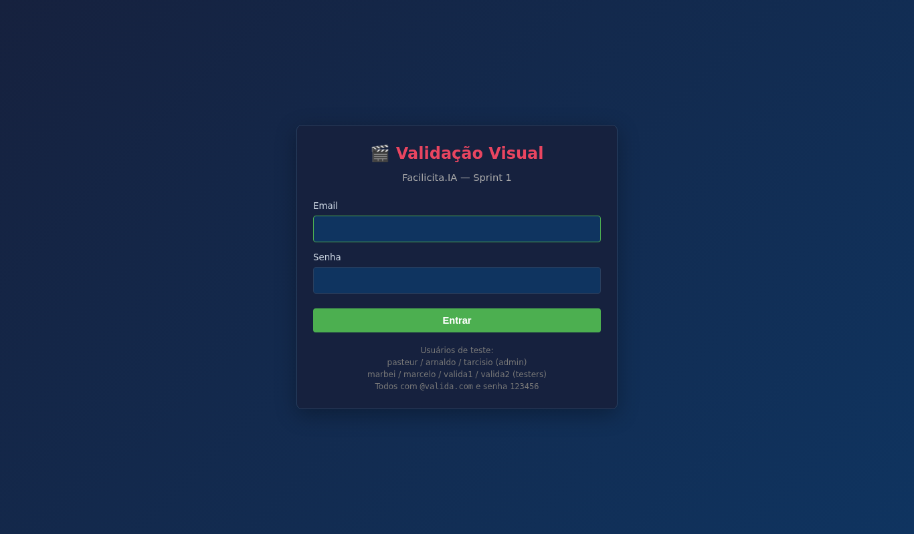

> **Figura 1.** Tela inicial. Insira e-mail e senha.

### 2.2. Inserir credenciais

Preencha:

- **E-mail:** `arnaldo@valida.com`
- **Senha:** `123456`

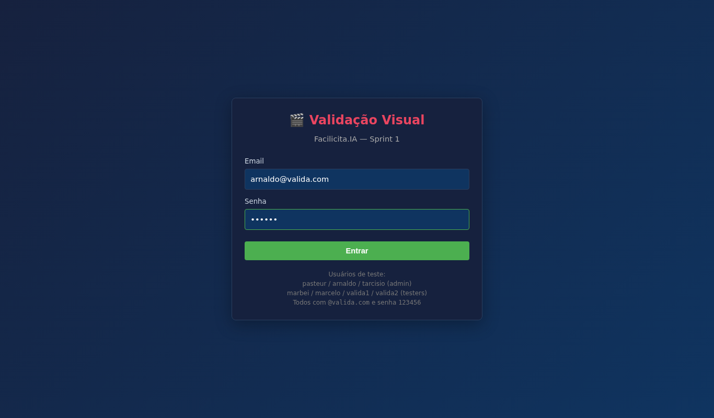

> **Figura 2.** E-mail e senha preenchidos. Em seguida, clique em **Entrar**.

### 2.3. Tela inicial

Após o login bem-sucedido, você cairá na **home** com seu nome no topo direito (`Olá, Arnaldo` com badge `ADMIN`):

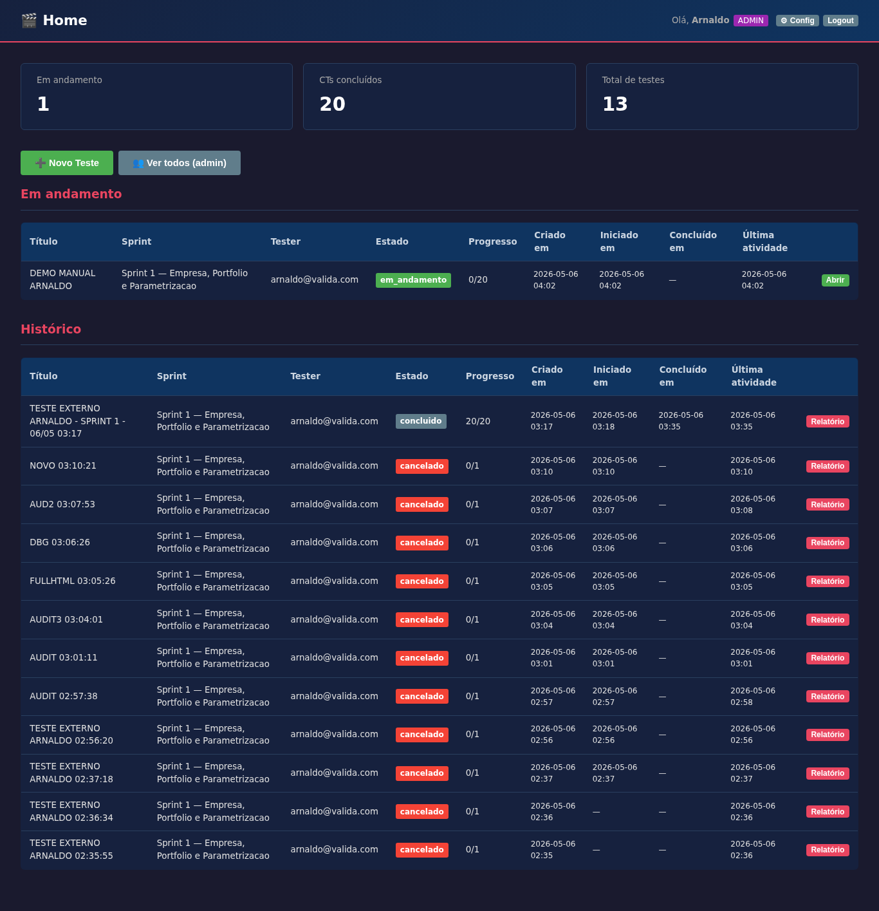

> **Figura 3.** Home após login. Note o botão **⚙ Config** no canto superior direito — você vai usá-lo na próxima etapa.

---

## 3. Configuração inicial — pasta de documentos sintetizados (FAÇA ANTES DO PRIMEIRO TESTE)

Alguns testes (ex.: UC-F03 cadastro de documentos, UC-CV10 anexos, UC-R05 recursos) **fazem upload de arquivos PDF**. Sem esses PDFs disponíveis em uma pasta no seu computador, esses testes **não rodam**.

Esta etapa é feita **uma única vez**. Depois fica salvo no seu perfil.

### 3.1. Abrir o painel de Configurações

Clique em **⚙ Config** no canto superior direito da home.


> **Figura 4.** Tela de Configurações. Tem 2 etapas: **(1) Baixar o ZIP** e **(2) Descompactar e informar a pasta**.

### 3.2. Baixar o pacote de documentos

Clique no botão verde **📦 Baixar documentos_sintetizados.zip**.


> **Figura 5.** Botão de download. Conteúdo: 91 PDFs, 35 UCs, 5 sprints (~2,3 MB).

O arquivo `documentos_sintetizados.zip` será baixado pelo seu navegador (geralmente vai pra pasta **Downloads** do seu computador).

### 3.3. ⚠ ANOTE O CAMINHO ONDE VOCÊ DESCOMPACTAR

Esta é a parte **mais importante**: você precisa **descompactar o ZIP em algum lugar do seu computador** e **lembrar exatamente onde colocou** — porque vai precisar colar esse caminho no campo da próxima etapa.

**Sugestão prática:**

- **Linux/Mac:** descompacte em `/home/<seu_usuario>/Downloads/documentos_sintetizados`
- **Windows:** descompacte em `C:\Users\<SeuUsuario>\Downloads\documentos_sintetizados`

> ⚠ **Importante:** o caminho deve apontar para a **pasta interna `documentos_sintetizados`** (a que contém as subpastas `sprint1/`, `sprint2/`, etc.), **não** para o ZIP em si nem para uma pasta acima.

### 3.4. Colar o caminho da pasta

De volta à tela de Configurações, cole o caminho que você acabou de anotar no campo de texto:


> **Figura 6.** Campo onde você cola o caminho da pasta descompactada.

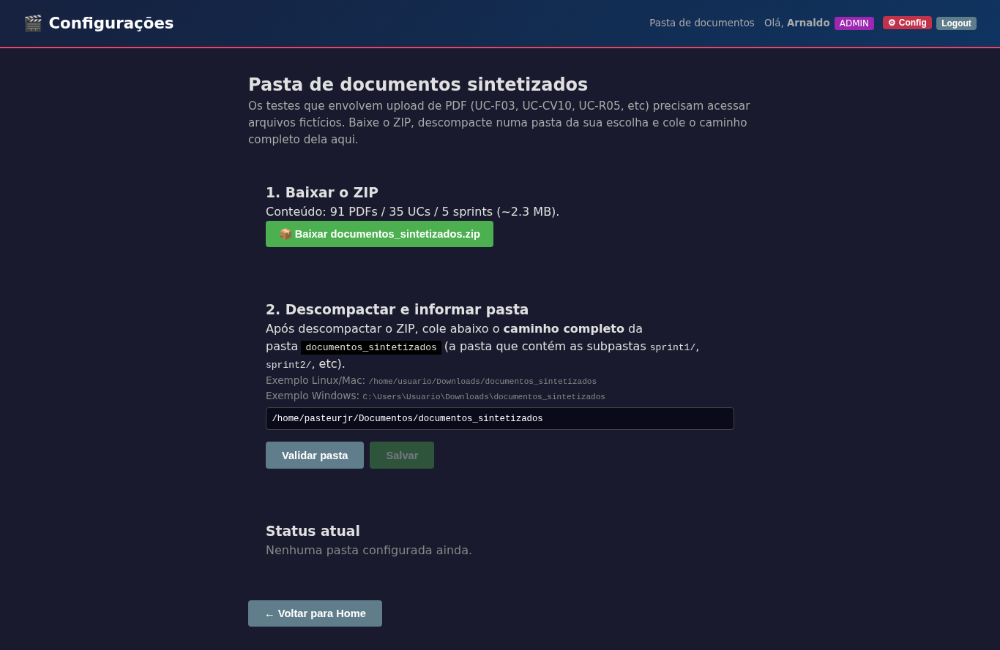

> **Figura 7.** Caminho preenchido (exemplo: `/home/pasteurjr/Documentos/documentos_sintetizados`).

### 3.5. Validar e salvar

1. Clique no botão **Validar pasta**. O sistema confere se a pasta existe e tem a estrutura correta:

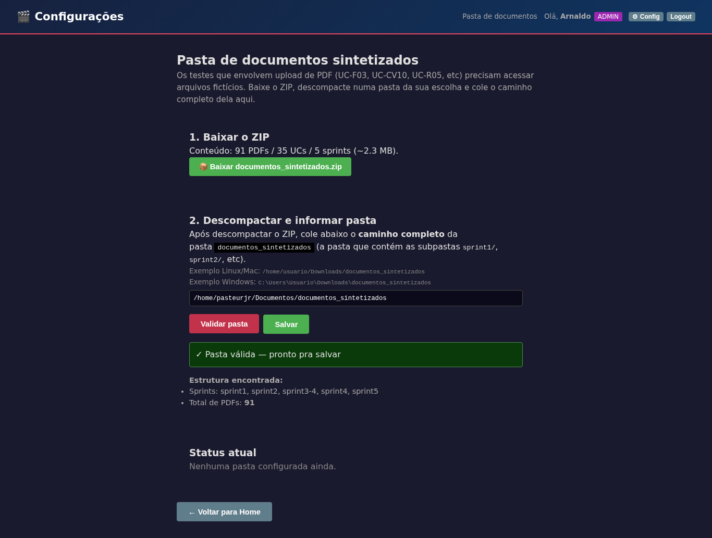

> **Figura 8.** Mensagem **✓ Pasta válida — pronto pra salvar** com a estrutura encontrada (5 sprints + 91 PDFs).

2. Em seguida, clique em **Salvar** (botão verde):

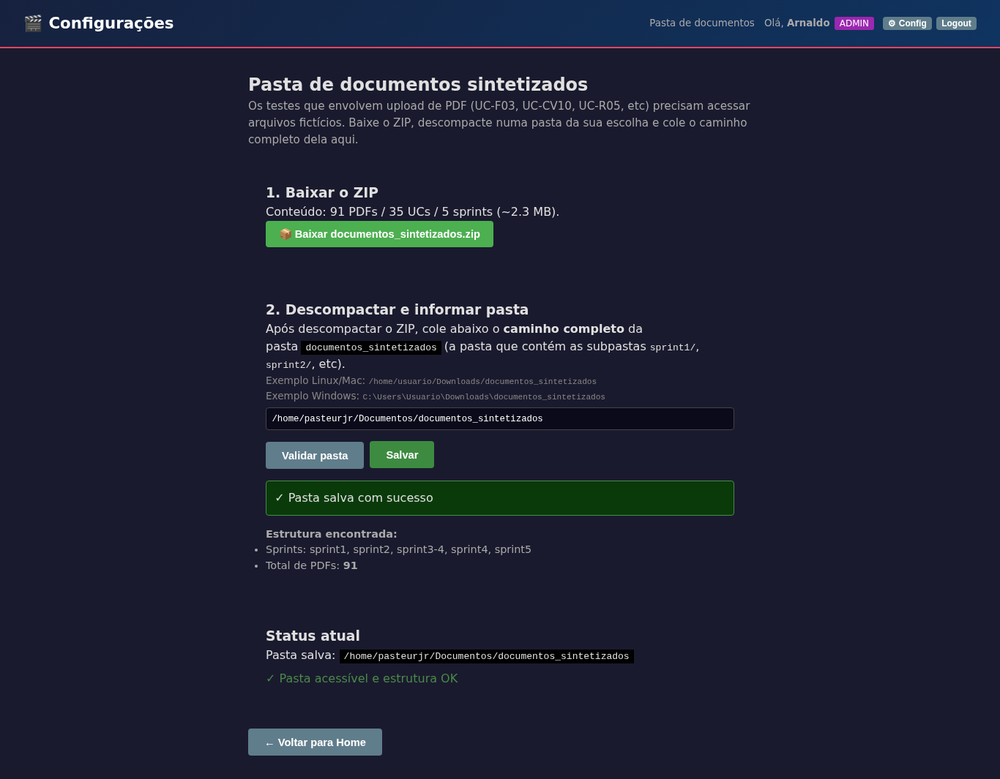

> **Figura 9.** Status final confirmando que a pasta foi salva no seu perfil.

3. Por fim, clique em **← Voltar para Home** no rodapé da página.

---

## 4. Selecionar projeto e sprint, e criar o teste

### 4.1. Voltar para Home

Após sair de Config, você vê a Home:


> **Figura 10.** Home após configuração. Clique em **➕ Novo Teste**.

### 4.2. Tela de Novo Teste

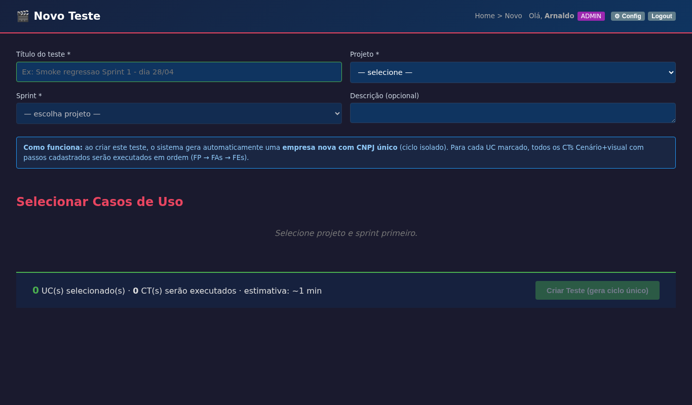

> **Figura 11.** Formulário em branco. Você vai preencher quatro coisas: Título, Projeto, Sprint, e marcar os UCs.

### 4.3. Preencher o título

Dê um nome descritivo ao seu teste. Sugestão de padrão:

```
DEMO MANUAL ARNALDO
```

ou

```
SMOKE SPRINT 1 — 06/05
```

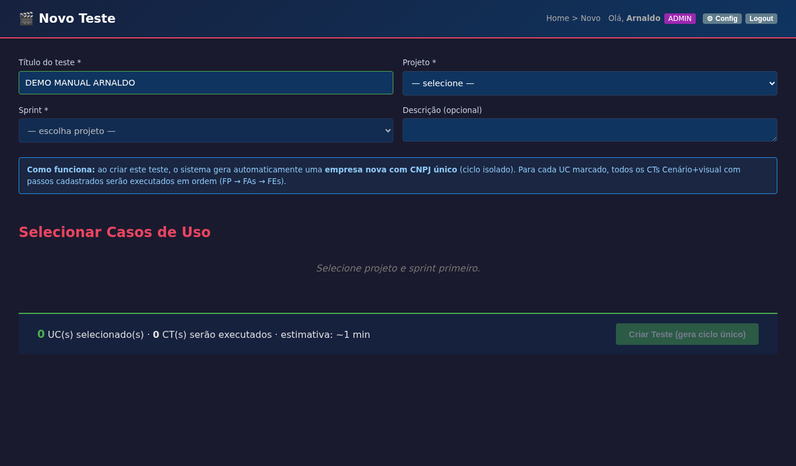

> **Figura 12.** Título do teste preenchido.

### 4.4. Selecionar o projeto

No dropdown **Projeto ***, escolha **Facilicita.IA** (geralmente único disponível):

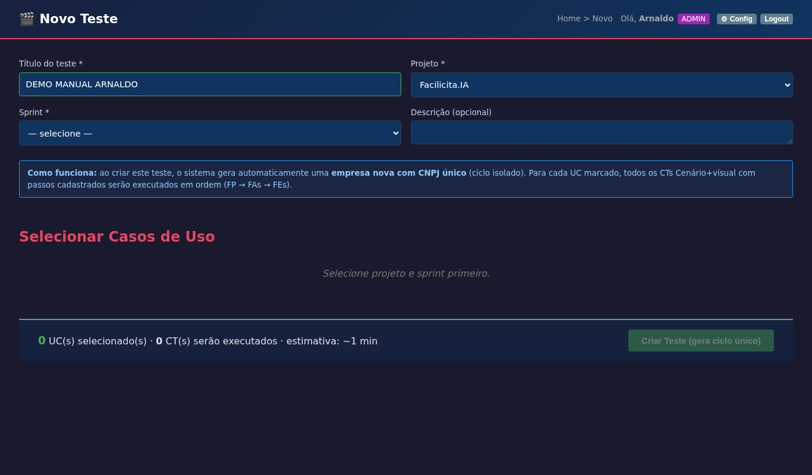

> **Figura 13.** Após escolher o projeto, o dropdown **Sprint** fica disponível.

### 4.5. Selecionar a sprint

No dropdown **Sprint ***, escolha a sprint que vai validar. Para o primeiro teste, selecione:

```
Sprint 1 — Empresa, Portfolio e Parametrização
```

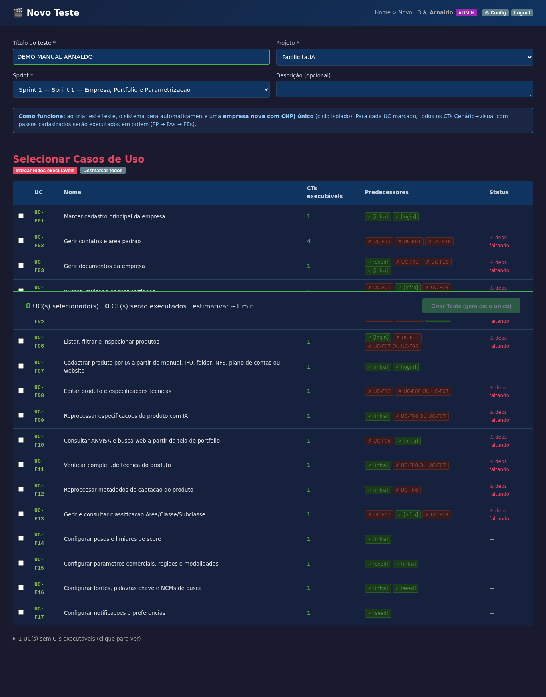

> **Figura 14.** Após escolher a sprint, a lista de **Casos de Uso** abaixo é carregada automaticamente.

---

## 5. Selecionar os casos de uso

### 5.1. Marcar todos os UCs

Para uma validação completa, clique no botão **Marcar todos** (acima da tabela), ou marque manualmente cada checkbox da coluna esquerda.


> **Figura 15.** Todos os 17 UCs da Sprint 1 marcados, totalizando 28 CTs (Casos de Teste) ~150 min de execução estimada.

> **Dica:** se quiser validar apenas UCs específicos, deixe marcados só esses. Mas atenção a UCs que dependem de outros (na coluna **Predecessores**) — se um UC depende de outro, marque os dois juntos.

### 5.2. Botão Criar Teste habilitado

Após marcar pelo menos 1 UC, o botão **Criar Teste (gera ciclo único)** fica em destaque (cor sólida):

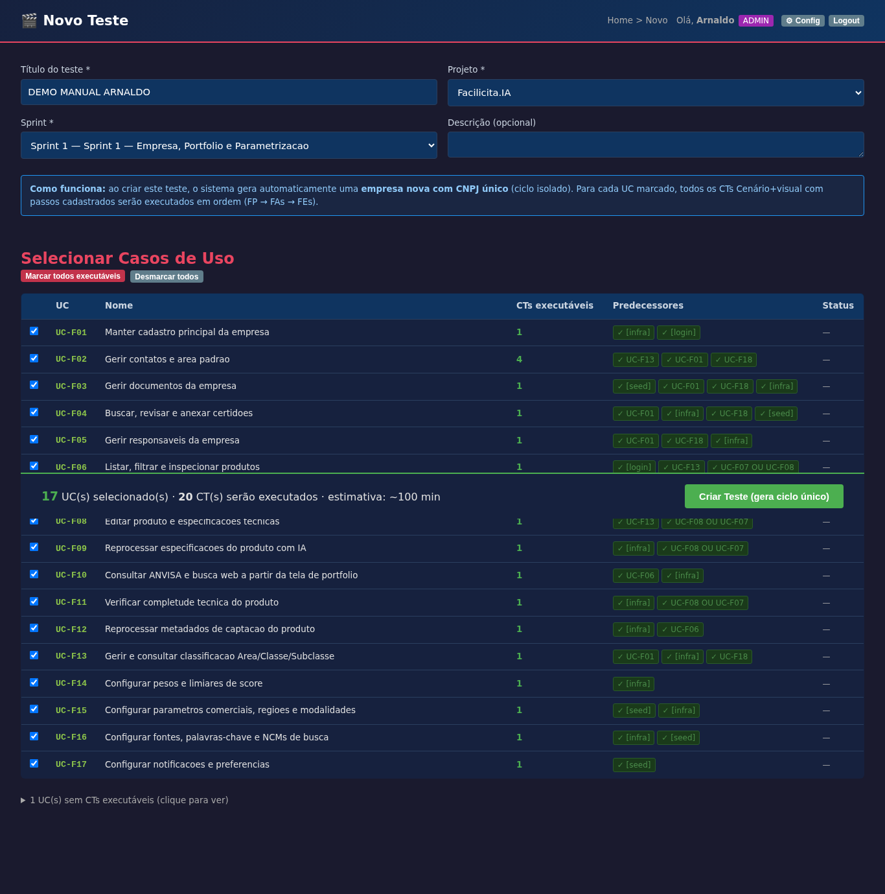

> **Figura 16.** Resumo no rodapé mostra quantos UCs foram selecionados e quantos CTs serão executados. Botão **Criar Teste** habilitado.

---

## 6. Criar o teste

Clique em **Criar Teste (gera ciclo único)**.

O sistema cria:

- Uma **empresa fictícia** com CNPJ válido e único só para este teste (ciclo isolado);
- Um **usuário sintético** vinculado a essa empresa;
- A lista de todos os Casos de Teste a executar.

Você é redirecionado para a **tela de detalhes do teste**:

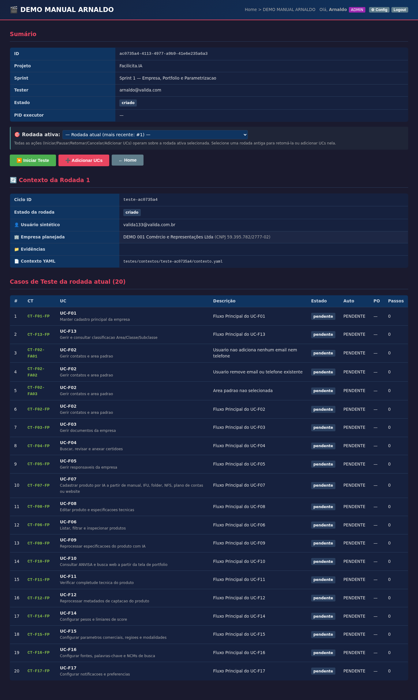

> **Figura 17.** Página de detalhes do teste com sumário (ID do teste, projeto, sprint, estado `criado`), contexto do ciclo (CNPJ da empresa fictícia, e-mail do usuário sintético) e a lista de **20 CTs pendentes** que serão executados.

---

## 7. Iniciar a execução

Na tela de detalhes do teste, clique no botão **Iniciar** (verde, no topo).

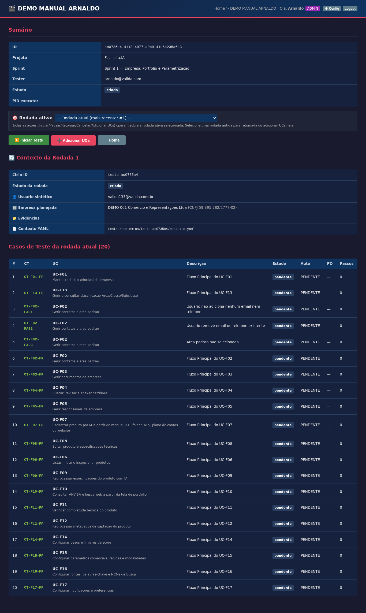

> **Figura 18.** Após clicar em **Iniciar**, o estado do teste muda para `em_andamento`. O servidor começa a abrir o navegador automatizado em segundo plano.

> **Aguarde uns 5-10 segundos.** O Playwright precisa subir o painel de validação (`:9876`) e abrir o navegador interno que vai navegar pelo seu sistema.

---

## 8. Tela do painel de validação (acompanhamento)

Após o teste iniciar, **abra uma nova aba** no navegador e acesse:

```
http://pasteurjr.servehttp.com:9876
```

Esta é a **tela do painel de validação** — onde você vai passar a maior parte do tempo.


> **Figura 19.** Painel de Validação Visual Acompanhada. Lado esquerdo: descrição do passo atual + botões de decisão. Lado direito: screenshots **Antes/Depois** + Histórico dos passos já validados.

### 8.1. Estrutura da tela do painel

| Área | O que mostra |
|---|---|
| **Topo direito** | Indicador `EXECUTANDO` ou `PAUSADO`, identificação do CT atual (ex: `CT-F01-FP (UC-F01)`), ciclo do teste |
| **Passo Atual** (esquerda topo) | Numeração do passo (`[N/Total]`) + nome humano (ex: `Login (FA-07 entrada)`) |
| **Descrição do passo** (esquerda) | Texto detalhado do que o robô deve fazer + critérios para você observar |
| **Asserts automáticos** (esquerda meio) | Resultado das verificações automáticas (DOM, rede, semântica) — mostradas com **✓** ou **✗** |
| **Sua decisão** (esquerda baixo) | Os botões **Aprovar** / **Reprovar** / **Não decidir** |
| **Observação** (esquerda baixo) | Campo de texto livre para você comentar |
| **Botões controle** (rodapé) | **Continuar**, **Pausar**, **Reiniciar** |
| **Screenshots Antes/Depois** (direita topo) | Print da tela do app **antes** do passo executar e **depois** |
| **Histórico** (direita baixo) | Lista de passos já decididos com seus vereditos |

---

## 9. Acompanhar e decidir cada passo

### 9.1. Ler o passo

Quando o robô termina de executar o passo, ele **pausa** e o painel mostra:


> **Figura 20.** Sistema pausou após executar o passo 00 (Login). Note o badge **PAUSADO** no topo direito. Os screenshots **Antes/Depois** já estão preenchidos.

**Como ler:**

1. **Leia a descrição do passo** (caixa esquerda em destaque) — vai dizer o que o robô tentou fazer e o que você deve observar.
2. **Compare os screenshots Antes vs Depois** (à direita) — confira se a tela mudou como esperado.
3. **Confira os asserts automáticos** (`Observe criticamente:`) — se aparecem **✓** o sistema já validou DOM/rede; se aparecem **✗** algo deu errado.

### 9.2. Onde estão os botões de decisão

Logo abaixo da descrição do passo, há três botões:


> **Figura 21.** Botões **Aprovar** (verde), **Reprovar** (vermelho) e **Não decidir** (cinza). Mais abaixo, campo livre **Observação (opcional)**.

---

## 10. Registrar observações

### 10.1. Quando preencher

A observação é **opcional**, mas você deve preenchê-la sempre que:

- Notar algo **diferente do esperado** mas que ainda assim funcione (ex.: cor, espaçamento, ordem dos botões);
- Encontrar **bug ou divergência** que vai justificar uma reprovação;
- Quiser **anotar contexto** que pode ajudar na revisão (ex.: "Demorou 5s pra carregar — lentidão pontual");
- O sistema marcou **algum assert como ✗** mas você considera que está OK por algum motivo (e vai aprovar mesmo assim).

### 10.2. Onde preencher

Clique no campo **Observação (opcional)** logo abaixo dos botões de decisão e digite:

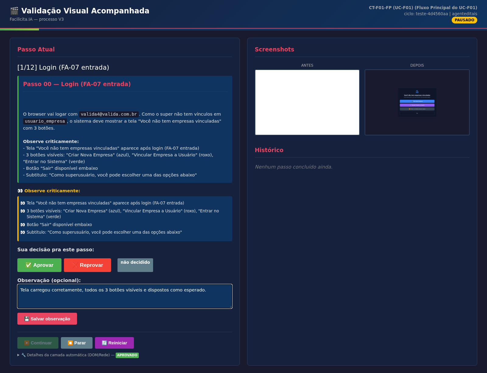

> **Figura 22.** Campo de observação com comentário do avaliador. Texto livre, sem limite forte.

### 10.3. Salvar a observação

Clique em **💾 Salvar observação** logo abaixo do campo. A observação fica vinculada **a este passo específico** (não é apagada quando você avança):


> **Figura 23.** Após salvar, a observação fica registrada e visível no histórico/relatório final.

---

## 11. Aprovar e continuar — sequência correta

A sequência **sempre** é:

1. **Analise** o passo (descrição + screenshots + asserts).
2. **Preencha observação** se necessário (e clique **Salvar observação**).
3. **Clique em Aprovar** (se tudo OK) **ou Reprovar** (se há problema).
4. **Clique em Continuar** para avançar ao próximo passo.

### 11.1. Clique em Aprovar

Se o comportamento está correto e os asserts ✓ estão OK, clique no botão verde **Aprovar**:

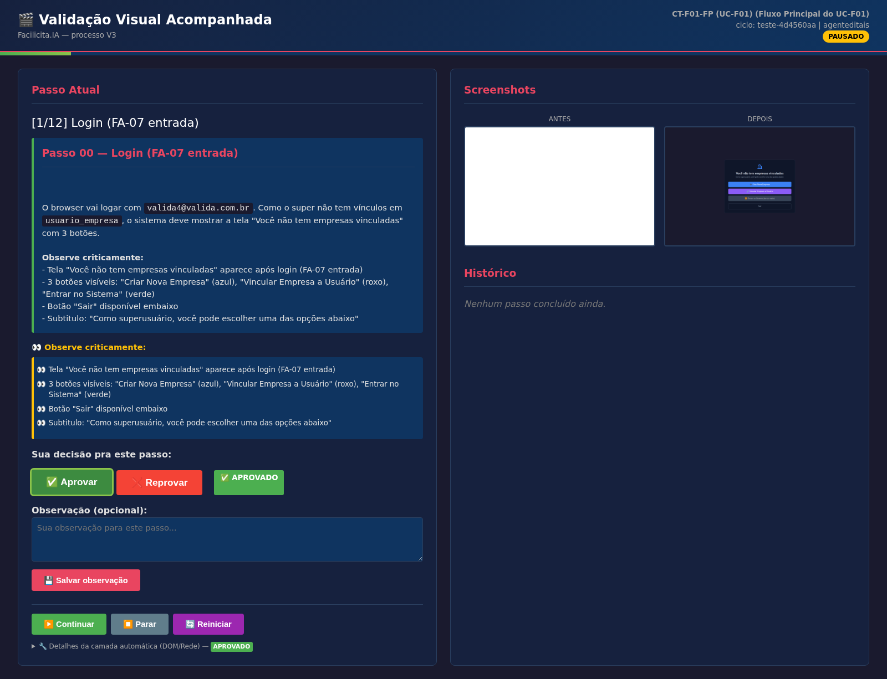

> **Figura 24.** Após aprovar, o passo recebe o badge `APROVADO` e o sistema fica pronto pra avançar.

### 11.2. Clique em Continuar

Para avançar para o próximo passo, clique em **▶ Continuar** (rodapé esquerdo):

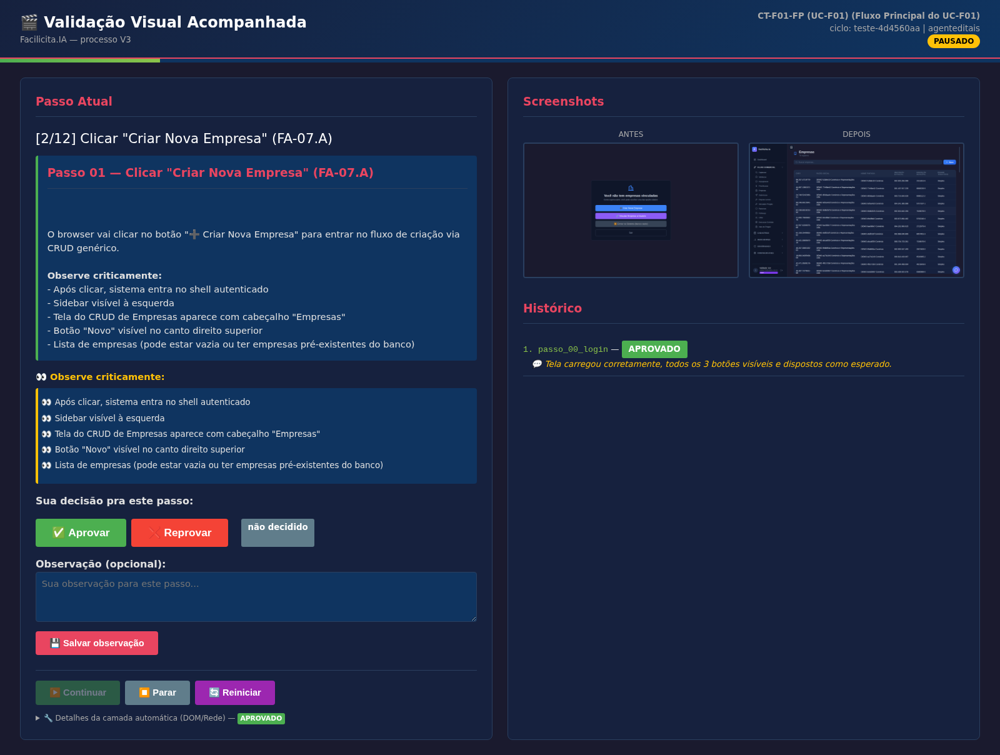

> **Figura 25.** O robô executa o próximo passo automaticamente. O painel volta para o estado `EXECUTANDO`, depois `PAUSADO` quando o novo passo termina.

> ⚠ **Importante:** **Aprovar não basta** — sem clicar em **Continuar**, o robô fica parado esperando sua decisão "ativa". A sequência é sempre `Aprovar` **+** `Continuar`.

### 11.3. Histórico de passos validados

Conforme você avança, o painel **Histórico** (direita baixo) acumula a lista de passos já decididos:

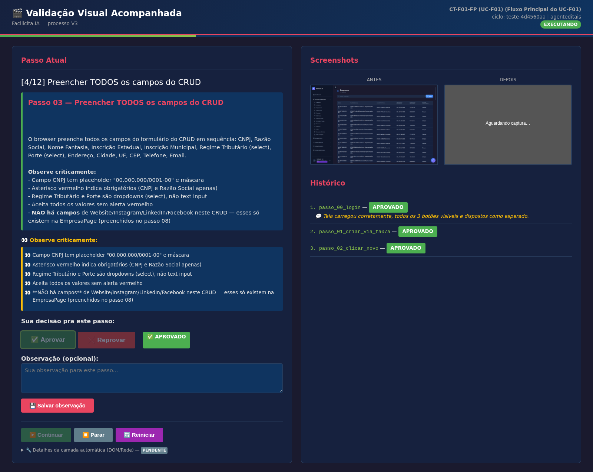

> **Figura 26.** Histórico com 4 passos aprovados. Você pode rolar para ver todos.

---

## 12. Repetir até o fim

Repita o ciclo `Analisar → (Observar) → Aprovar/Reprovar → Continuar` para **cada passo de cada CT**:

- Cada **CT** (Caso de Teste) tem entre 3 e 12 passos.
- Cada **UC** (Caso de Uso) pode ter 1 ou mais CTs.
- A Sprint 1, por exemplo, tem **20 CTs** ao todo.
- O tempo médio é de **~17 minutos por sprint** se você for ágil nas decisões.

Quando o último CT do último UC for concluído, o painel mostra a **mensagem final de sucesso** com a contagem de aprovados/reprovados/inconclusivos. **Esse é o sinal de que o teste terminou.**

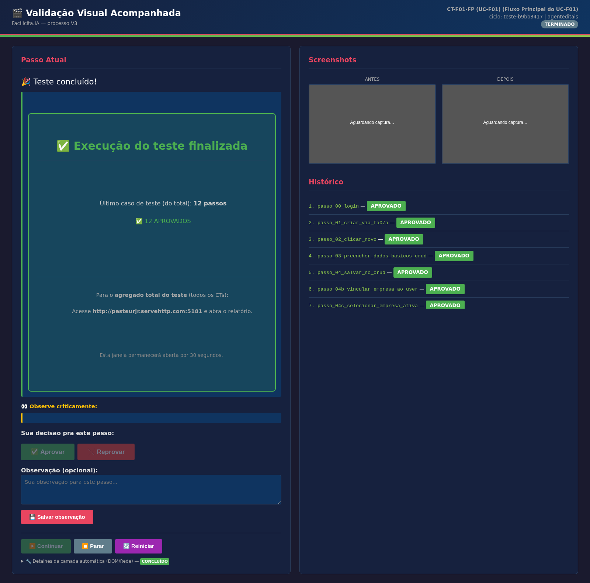

> **Figura 28.** Mensagem final do painel quando o teste é concluído com sucesso: **🎬 Teste concluído! / ✅ Execução do teste finalizada / 12 APROVADOS**. O badge no canto superior direito muda para **TERMINADO** e o histórico (à direita) lista todos os passos aprovados do último CT. A janela permanece aberta por 30 segundos antes de fechar automaticamente.

> Você deve **prosseguir até essa mensagem final** — não pare antes.

---

## 13. Pausar, parar ou reiniciar o teste

No rodapé do painel há três botões:


> **Figura 27.** Botões de controle no rodapé.

| Botão | Quando usar |
|---|---|
| **▶ Continuar** | Avançar pro próximo passo (já explicado na seção 11). |
| **⏸ Pausar** | Pausar a execução (precisa de uma pausa, banheiro, almoço, etc.). O teste permanece com estado `pausado` até você voltar e clicar em Continuar. |
| **🔄 Reiniciar** | Reinicia o **CT atual do zero** (todos os passos do CT atual são reexecutados). Útil se você suspeitar que houve um erro e quer ver de novo. **Cuidado:** isso só reinicia o CT, não o teste inteiro. |

### 13.1. Cancelar (parar) o teste todo

Para cancelar o teste inteiro antes do fim:

- Volte à aba do **listador de testes** (URL `http://pasteurjr.servehttp.com:5181`)
- Acesse seu teste em andamento
- Clique no botão **Cancelar** (ou similar) no topo da página de detalhes

> O teste cancelado é registrado no banco. Se você quiser **rodar de novo a partir do mesmo ponto**, use o botão **Reiniciar rodada** que aparece após o cancelamento.

---

## 14. O que fazer em caso de erro, travamento ou comportamento inesperado

| Sintoma | O que fazer |
|---|---|
| Botões **Aprovar/Continuar** não respondem | Recarregue a aba (F5). Os passos já decididos não se perdem. |
| Painel `:9876` mostra `Connection refused` | O teste ainda não iniciou ou já terminou. Volte ao listador (`:5181`) e confira o estado do teste. |
| Screenshots não aparecem | Aguarde alguns segundos. Em testes com IA (ex.: UC-F07, UC-F09, UC-F10) cada passo pode levar 1-2 min. |
| Robô parado por mais de 5 minutos no mesmo passo | Pode estar aguardando uma resposta lenta de IA externa. Aguarde até 5 min. Se persistir, clique em **Reprovar** + **Continuar** com observação descrevendo o problema. |
| Aviso "Já há outro teste rodando" | Algum teste anterior não foi finalizado. Volte à lista, cancele o teste antigo e tente iniciar de novo. |
| Mensagem `pasta de documentos não configurada` | Volte em **⚙ Config** (seção 3 deste manual) e confirme que a pasta está válida e salva. |

> **Em qualquer dúvida ou erro persistente:** anote o passo onde ocorreu, tire um print da tela e comunique o time de desenvolvimento. As observações que você salvar no painel **já viram parte do relatório automaticamente**.

---

## 15. Boas práticas para o avaliador

✅ **Não feche a aba do navegador** durante o teste — você perde acesso ao painel (mas o teste continua rodando no servidor).

✅ **Aguarde o carregamento completo** das telas antes de aprovar. Se o screenshot **DEPOIS** ainda mostra o estado anterior, pode ser que o passo nem terminou — espere mais um pouco.

✅ **Registre observações claras e objetivas.** Em vez de "estranho", escreva "Botão Salvar mudou de azul para cinza após o clique, sem mensagem de feedback".

✅ **Não aprove passos sem verificar.** Se você marcar tudo como `Aprovado` sem olhar, perde o sentido do teste.

✅ **Comunique qualquer erro ou divergência** mesmo que pareça pequeno — pode ser sintoma de algo maior em outra parte.

✅ **Use `Reprovar` quando notar bug.** A reprovação alimenta o relatório e ajuda o time a corrigir.

✅ **Faça um teste por sessão.** É melhor concentrar 17 min em uma sprint inteira do que misturar várias sprints em horários picados.

---

## 16. Conclusão

Seguindo este manual, você consegue:

1. **Acessar** o sistema externo via `pasteurjr.servehttp.com:5181`;
2. **Configurar** a pasta de documentos sintetizados (uma vez só);
3. **Criar e iniciar** testes da sprint que quiser validar;
4. **Acompanhar** o robô passo a passo via painel `pasteurjr.servehttp.com:9876`;
5. **Registrar observações** vinculadas a cada passo;
6. **Aprovar/Reprovar** com critério, baseado nos screenshots e asserts;
7. **Avançar** até a mensagem final de sucesso;
8. **Gerar** automaticamente um relatório auditável do teste.

Bom trabalho de validação! 🎬

---

**Documento gerado em:** 06/05/2026
**URL do sistema:** http://pasteurjr.servehttp.com:5181
**Painel de validação:** http://pasteurjr.servehttp.com:9876
**Suporte técnico:** Pasteur (pasteurjr@gmail.com)
