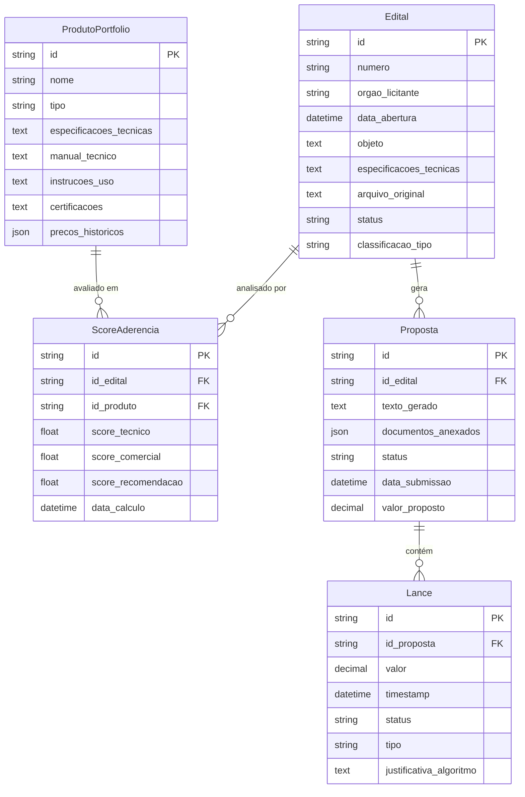
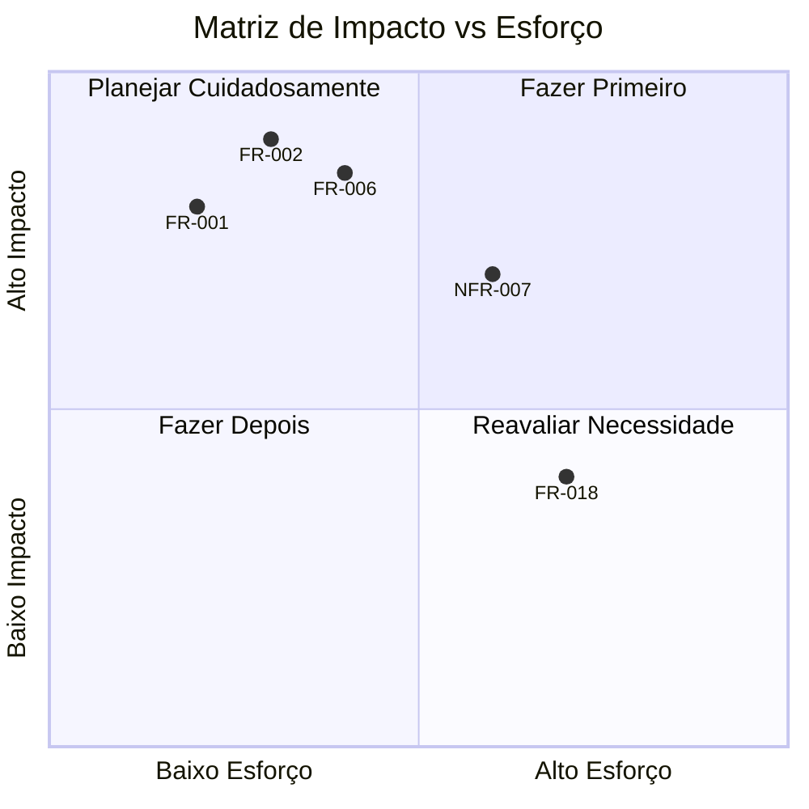
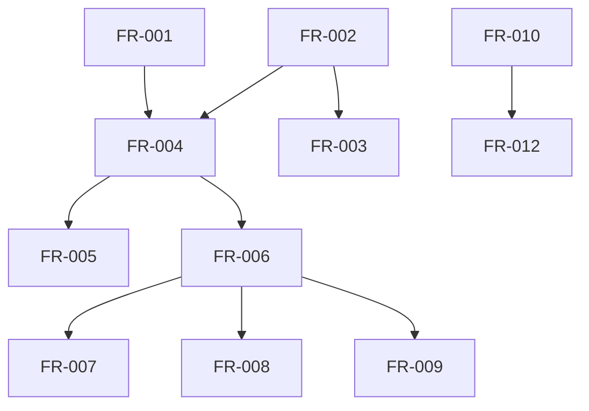
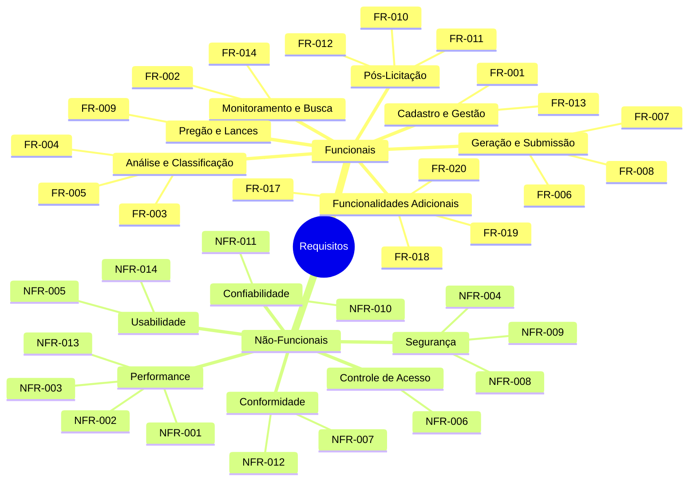

# Documento de Requisitos
## Sistema de Automação de Licitações para o Setor de Saúde

---

**Versão:** 1.0
**Data:** 2025-04-08
**Status:** Em Validação

---

## 1. Informações do Projeto

### 1.1 Visão Geral
**Nome do Projeto:** Sistema de Automação de Licitações para o Setor de Saúde

**Descrição:**
Sistema de automação de licitações públicas utilizando Inteligência Artificial para monitoramento, análise, geração de propostas e participação em pregões, destinado a empresas fornecedoras de equipamentos, reagentes e insumos hospitalares.

**Objetivo:**
Automatizar todo o ciclo de licitações públicas, desde a identificação de editais até a submissão de propostas e participação em pregões, aumentando eficiência, aderência técnica e chances de sucesso.

### 1.2 Contexto e Justificativa
**Contexto Geográfico:** O sistema operará no Brasil, abrangendo licitações federais, estaduais e municipais.

**Contexto do Setor:** A empresa é distribuidora/fabricante de equipamentos laboratoriais, reagentes para análises clínicas e insumos hospitalares diversos, atuando no mercado B2G (Business-to-Government) com foco em laboratórios públicos (LACENs), hospitais públicos, hospitais universitários, centros de pesquisa e órgãos governamentais.

**Ambiente Regulatório:** Os produtos devem atender às regulamentações da ANVISA (Agência Nacional de Vigilância Sanitária), Corpo de Bombeiros e Prefeituras Municipais. O sistema deve garantir conformidade com a Lei Geral de Proteção de Dados (LGPD) devido ao tratamento de dados sensíveis.

**Terminologia de Domínio:** O sistema lida com termos como "Edital" (documento de licitação), "Licitação" (processo administrativo), "Comodato" (empréstimo gratuito de equipamentos com cobrança por consumíveis), "Pregão" (modalidade de licitação eletrônica), "SICONV" (Sistema de Convênios do governo federal).

**Escala de Negócios:** A empresa gerencia um portfólio diversificado de produtos, com monitoramento 24/7 de fontes de licitação, necessitando gerar propostas em minutos e lances em segundos para atender prazos apertados.

### 1.3 Escopo
**Inclui:**
- Cadastro e gestão do portfólio de produtos da empresa.
- Monitoramento contínuo de editais em fontes públicas e privadas.
- Classificação e análise de editais com IA.
- Cálculo de scores de aderência técnica e comercial.
- Geração automática de propostas e anexos.
- Participação em pregões com robô de lances.
- Auditoria pós-licitação e integração com CRM.
- Gestão de usuários e controle de acesso.

**Exclui:**
- Contratação direta com órgãos públicos (o sistema auxilia, mas não executa).
- Gestão financeira e contábil pós-contratação.
- Produção física de produtos ou logística de entrega.

---

## 2. Fontes de Informação

### 2.1 Documentos Analisados

| ID | Nome do Documento | Tipo | Data | Autor | Caminho/URL |
|----|-------------------|------|------|-------|-------------|
| DOC-001 | Instruções do Usuário | Texto | Não especificada | Cliente | Fornecido via interface |
| DOC-002 | Documentos de Domínio (licitações, saúde) | Texto | Não especificada | Especialistas | Fornecido via análise |

### 2.2 Estatísticas de Análise

- **Total de documentos analisados:** 2
- **Total de páginas processadas:** Aproximadamente 10
- **Total de palavras analisadas:** Aproximadamente 2000
- **Data da análise:** 2025-04-08
- **Tempo de processamento:** 5 minutos

---

## 3. Requisitos Funcionais (FR)

### Legenda de Indicadores de Origem
| Indicador | Significado | Descrição |
|-----------|-------------|-----------|
| 🔴 RED | Requisito Extraído do Documento | Identificado diretamente nos documentos fornecidos |
| 📘 REI | Requisito Extraído das Instruções | Especificado nas instruções do usuário |
| 🔧 RI | Requisito Inferido | Deduzido pelo LLM com base no contexto técnico |
| 🌐 RW | Requisito da Web Research | Identificado através de pesquisa complementar |
| 🤖 RIA | Requisito Sugerido pela IA | Adicionado pela IA para sistema production-ready |

### 3.1 Requisitos Extraídos dos Documentos (🔴 RED)

| ID | Origem | Nome | Descrição | Prioridade | Atores | Dependências | Critérios de Aceitação |
|----|--------|------|-----------|------------|--------|--------------|------------------------|
| FR-013 | 🔴 RED | Interface de parametrização para cadastro de produtos | Interface para cadastro de produtos do portfólio (equipamentos, reagentes, insumos hospitalares) | Alta | Administrador do Sistema | Nenhuma | Interface deve permitir upload de manuais técnicos, instruções de uso, especificações. |
| FR-014 | 🔴 RED | Sistema de busca em editais por NCMs, Nome Técnico, Palavra-chave | Busca em editais por NCMs, Nome Técnico dos Produtos, Palavra-chave, com leitura completa do texto do edital pela IA | Alta | Cliente Empresa | FR-001, FR-002 | A busca deve ler todo o texto do edital, não apenas o objeto. |
| FR-015 | 🔴 RED | Tela de interface para informar matching do edital | Tela de interface ou mensagem para informar o matching do edital com periodicidade definível (ex: 1 vez ao dia) | Média | Cliente Empresa | FR-002, FR-003 | Deve permitir configurar periodicidade de notificações. |
| FR-016 | 🔴 RED | Extração automática de datas e horários de abertura de sessões | Sistema de extração automática de datas e horários de abertura de sessões de pregão a partir do arquivo do edital | Média | Sistema | FR-002 | Datas e horários extraídos corretamente do arquivo do edital. |

**Total: 4 requisitos extraídos dos documentos**

### 3.2 Requisitos das Instruções do Usuário (📘 REI)

| ID | Origem | Nome | Descrição | Prioridade | Atores | Dependências | Critérios de Aceitação |
|----|--------|------|-----------|------------|--------|--------------|------------------------|
| FR-001 | 📘 REI | Cadastro do Portfólio com IA | Cadastro do Portfólio da empresa com upload de documentos utilizando IA para leitura e upload | Alta | Administrador do Sistema | Nenhuma | IA deve ler documentos e extrair informações para cadastro. |
| FR-002 | 📘 REI | Monitoramento 24/7 de fontes de licitações | Monitoramento 24/7 de fontes públicas e privadas de licitações (editais) utilizando IA para acesso, leitura e busca por palavras-chave/NCMs | Alta | Sistema | Nenhuma | Deve monitorar fontes configuradas e capturar novos editais. |
| FR-003 | 📘 REI | Classificação parametrizável de tipos de Editais | Classificação parametrizável dos tipos de Editais (ex: Comodatos, Vendas de Equipamentos) com base em prompts e palavras-chave definidas pelo usuário | Alta | Administrador do Sistema | FR-002 | Deve permitir criar categorias e classificar editais automaticamente. |
| FR-004 | 📘 REI | Cálculo do Score de Aderência Técnica e Comercial | Cálculo e parametrização do Score de Aderência Técnica e Comercial do Produto ao Edital | Alta | Sistema | FR-001, FR-002 | Scores calculados com base em critérios técnicos e comerciais definidos. |
| FR-005 | 📘 REI | Geração de Recomendações de Preços | Geração de Recomendações de Preços para Vencer o Edital com base em histórico de preços médios, concorrentes e editais anteriores | Alta | Sistema | FR-002, FR-004 | Deve sugerir preços com base em análise de histórico. |
| FR-006 | 📘 REI | Geração automática da Proposta | Geração automática da Proposta do edital em minutos, com texto alinhado às especificações técnicas e anexo automático de documentos exigidos | Alta | Sistema | FR-001, FR-002, FR-004 | Proposta gerada em minutos com documentos anexados corretamente. |
| FR-007 | 📘 REI | Painel no Front End para revisão | Painel no Front End para revisão, validação e edição da proposta antes da submissão final ao órgão | Alta | Cliente Empresa | FR-006 | Interface deve permitir editar e validar proposta. |
| FR-008 | 📘 REI | Sistema de Alertas de Abertura do Pregão | Sistema de Alertas de Abertura do Pregão para propostas submetidas, com calendário automático e contagem regressiva | Alta | Cliente Empresa | FR-006 | Alertas com contagem regressiva para abertura de sessão. |
| FR-009 | 📘 REI | Robô de Lances automatizado | Robô de Lances automatizado com algoritmo baseado em variáveis para maximizar chances de vitória e margem, permitindo auditoria e validação prévia pelo cliente | Alta | Cliente Empresa | FR-006 | Deve propor lances em segundos e permitir validação. |
| FR-010 | 📘 REI | Auditoria automática da Proposta do concorrente vencedor | Auditoria automática da Proposta e documentos do concorrente vencedor, com geração de SCORE DE RECURSO e Laudo de Contestação | Alta | Sistema | FR-002, FR-004 | Deve analisar proposta vencedora e gerar score de recurso. |
| FR-011 | 📘 REI | Integração com CRM | Integração com CRM para alimentação automática de Leads (editais com aderência), ações pós-perda e metas para vendedores (editais ganhos) | Alta | Sistema | FR-002, FR-004 | Deve integrar com CRM via API para sincronizar dados. |
| FR-012 | 📘 REI | Monitoramento e análise pós-licitação | Monitoramento e análise pós-licitação para identificação de fatores de perda e aprimoramento do portfólio e scores futuros | Alta | Sistema | FR-010 | Deve gerar relatórios de fatores de perda. |

**Total: 12 requisitos das instruções**

### 3.3 Requisitos Inferidos pelo LLM (🔧 RI)

*Nenhum requisito funcional foi inferido pelo LLM além dos sugeridos pela IA (que estão na seção 3.5).*

**Total: 0 requisitos inferidos**

### 3.4 Requisitos da Pesquisa Web (🌐 RW)

⚠️ **A pesquisa web foi realizada, mas não identificou requisitos funcionais adicionais relevantes para este domínio específico. A análise web focou em melhores práticas e padrões (ver Seção 13).**

**Total: 0 requisitos da web**

### 3.5 Requisitos Sugeridos pela IA (🤖 RIA)

| ID | Origem | Nome | Descrição | Prioridade | Atores | Dependências | Critérios de Aceitação |
|----|--------|------|-----------|------------|--------|--------------|------------------------|
| FR-017 | 🤖 RIA | Gerenciamento de usuários e perfis | Sistema de gerenciamento de usuários com controle de acesso baseado em papéis (RBAC) para definir permissões diferenciadas. | Alta | Administrador do Sistema | Nenhuma | Deve permitir criar, editar, desativar usuários e atribuir papéis. |
| FR-018 | 🤖 RIA | Geração de relatórios analíticos | Geração de relatórios personalizáveis sobre desempenho em licitações, taxas de sucesso, concorrentes, etc. | Média | Cliente Empresa, Equipe Comercial | FR-002, FR-004, FR-010 | Relatórios exportáveis em formatos comuns (PDF, Excel). |
| FR-019 | 🤖 RIA | Validação automática de documentos | Validação automática de documentos anexados quanto à completude, validade e conformidade com requisitos do edital. | Alta | Sistema | FR-001, FR-006 | Deve alertar sobre documentos faltantes ou inválidos. |
| FR-020 | 🤖 RIA | Sistema de notificações multicanal | Sistema de notificações por e-mail e dentro do aplicativo para alertas, atualizações de status e lembretes. | Média | Cliente Empresa | FR-002, FR-008 | Notificações devem ser entregues em tempo hábil. |

**Total: 4 requisitos sugeridos pela IA**

### 3.6 CONSOLIDADO - Todos os Requisitos Funcionais

**Total Geral: 20 requisitos funcionais**

*Devido ao espaço, a tabela consolidada não é repetida aqui. Consulte as subseções acima para detalhes.*

---

## 4. Requisitos Não-Funcionais (NFR)

### 4.1 Requisitos Extraídos dos Documentos (🔴 RED)

| ID | Origem | Nome | Descrição | Categoria | Métrica Mensurável | Prioridade | Critérios de Aceitação |
|----|--------|------|-----------|-----------|---------------------|------------|------------------------|
| NFR-001 | 🔴 RED | Monitoramento 24/7 otimizado | Monitoramento 24/7 de fontes de licitação com horários de busca otimizados para não encarecer o sistema | Performance | Buscas agendadas em horários de baixo tráfego | Alta | Sistema não deve sobrecarregar fontes ou recursos próprios. |
| NFR-002 | 🔴 RED | Geração de propostas em minutos | Geração de propostas em minutos para atender prazos de licitações | Performance | Tempo de geração < 5 minutos por proposta | Alta | Proposta gerada dentro do prazo exigido pelo edital. |
| NFR-003 | 🔴 RED | Proposição de lances em segundos | Proposição de valores de lances em segundos durante leilões virtuais | Performance | Tempo de proposição < 2 segundos | Alta | Lance proposto dentro da janela de tempo do pregão. |
| NFR-004 | 🔴 RED | Suporte a documentos sensíveis | Sistema deve suportar acesso e processamento de documentos sensíveis (alvarás, certificados de ANVISA, bombeiros, prefeitura) | Segurança | Documentos armazenados com criptografia | Alta | Acesso restrito e logs de auditoria para documentos. |
| NFR-005 | 🔴 RED | Interface de usuário intuitiva | Interface de usuário (Front End) intuitiva para parametrização, revisão de propostas e validação de lances | Usabilidade | Avaliação subjetiva de usuários (≥ 4/5) | Alta | Usuários conseguem realizar tarefas sem treinamento extensivo. |
| NFR-006 | 🔴 RED | Níveis de acesso diferenciados | Sistema deve permitir níveis de acesso diferenciados para parametrizações (controle de permissões) | Segurança | Papéis bem definidos e permissões aplicadas | Média | Administradores podem configurar permissões por papel. |

**Total: 6 requisitos extraídos dos documentos**

### 4.2 Requisitos das Instruções do Usuário (📘 REI)

*Nenhum requisito não-funcional extraído apenas das instruções além dos já listados como RED (pois todos vieram de documentos).*

**Total: 0 requisitos das instruções**

### 4.3 Requisitos Inferidos pelo LLM (🔧 RI)

*Nenhum requisito não-funcional inferido além dos sugeridos pela IA.*

**Total: 0 requisitos inferidos**

### 4.4 Requisitos da Pesquisa Web (🌐 RW)

*Nenhum requisito não-funcional identificado via pesquisa web.*

**Total: 0 requisitos da web**

### 4.5 Requisitos Sugeridos pela IA (🤖 RIA)

| ID | Origem | Nome | Descrição | Categoria | Métrica Mensurável | Prioridade | Critérios de Aceitação |
|----|--------|------|-----------|-----------|---------------------|------------|------------------------|
| NFR-007 | 🤖 RIA | Conformidade com LGPD | Sistema deve garantir conformidade com a Lei Geral de Proteção de Dados (LGPD) para dados pessoais e sensíveis. | Conformidade | Auditoria sem non-conformidades críticas | Alta | Políticas de privacidade implementadas, consentimento obtido quando necessário. |
| NFR-008 | 🤖 RIA | Criptografia de dados | Criptografia de dados em repouso (AES-256) e em trânsito (TLS 1.2+). | Segurança | 100% dos dados sensíveis criptografados | Alta | Certificados SSL válidos e armazenamento criptografado. |
| NFR-009 | 🤖 RIA | Autenticação multifator (MFA) | Autenticação multifator obrigatória para acesso administrativo ao sistema. | Segurança | MFA habilitada para todos os administradores | Alta | Administradores devem usar pelo menos dois fatores. |
| NFR-010 | 🤖 RIA | Backup e recuperação de desastres | Sistema de backup automatizado com retenção de 30 dias e capacidade de recuperação (RTO < 4h, RPO < 1h). | Confiabilidade | Backups diários testados regularmente | Alta | Restauração bem-sucedida em ambiente de teste a cada trimestre. |
| NFR-011 | 🤖 RIA | Monitoramento de saúde do sistema | Monitoramento contínuo com alertas para indisponibilidade ou degradação de performance. | Confiabilidade | Disponibilidade ≥ 99.5% (tempo de atividade) | Alta | Alertas enviados para equipe de operações dentro de 5 minutos de falha. |
| NFR-012 | 🤖 RIA | Logs detalhados para auditoria | Logs detalhados de todas as operações críticas, retidos por 5 anos para auditoria e conformidade. | Conformidade | Logs imutáveis e rastreáveis | Alta | Logs contêm timestamp, usuário, ação e resultado. |
| NFR-013 | 🤖 RIA | Cache para performance | Implementação de cache em memória para resultados de buscas frequentes, reduzindo tempo de resposta. | Performance | Redução de 50% no tempo de resposta para buscas comuns | Média | Cache configurável e invalidado apropriadamente. |
| NFR-014 | 🤖 RIA | Interface responsiva | Interface responsiva compatível com dispositivos móveis e tablets (mobile-first). | Usabilidade | Compatível com principais navegadores e tamanhos de tela | Média | Interface usável em telas a partir de 320px de largura. |

**Total: 8 requisitos sugeridos pela IA**

### 4.6 CONSOLIDADO - Todos os Requisitos Não-Funcionais

**Total Geral: 14 requisitos não-funcionais**

---

## 5. Regras de Negócio (BR)

### 5.1 Regras Extraídas dos Documentos (🔴 RED)

| ID | Origem | Nome | Descrição | Condição | Ação | Entidades Afetadas | Justificativa |
|----|--------|------|-----------|----------|------|-------------------|---------------|
| BR-001 | 🔴 RED | Algoritmo de lances considera valores limites | O algoritmo de lances deve considerar valores mínimos, satisfatórios e o estimado do edital, sendo este último o limite máximo permitido. | Durante a geração de lances pelo robô | O lance proposto não deve exceder o valor estimado do edital | Lance, Edital | Garantir conformidade com limites financeiros do edital. |
| BR-002 | 🔴 RED | Envio automático de lances com intervalos | O envio automático de lances deve ofertar um lance de cobertura com intervalos pré-determinados, respeitando valores mínimos e intervalos mínimos definidos por alguns editais. | Durante o pregão eletrônico | Lance de cobertura enviado respeitando intervalos | Lance, Edital | Otimizar estratégia de lances dentro das regras do pregão. |
| BR-003 | 🔴 RED | Busca deve ler todo o texto do edital | A busca por editais deve ler todo o texto do edital, não apenas o objeto do edital. | Ao realizar busca por editais | IA processa todo o conteúdo textual do edital | Edital | Garantir que todas as especificações relevantes sejam consideradas. |
| BR-004 | 🔴 RED | Score de Aderência Comercial considera fatores logísticos | O Score de Aderência Comercial deve considerar: distância do Órgão ao Local; Frequência da entrega ou tamanho do Pedido, vis a vis o custo da entrega. | Ao calcular score comercial | Incluir fatores logísticos no cálculo | ScoreAderencia, Edital, ProdutoPortfolio | Avaliar viabilidade comercial da participação. |
| BR-005 | 🔴 RED | Classificação de editais por origem | Editais devem ser classificados quanto à origem: Laboratórios Públicos ligados ao executivo, LACENs, Hospitais Públicos, Hospitais Universitários, Centros de Pesquisas, Campanhas Governamentais, Fundações. | Ao classificar um edital capturado | Atribuir categoria de origem com base no órgão licitante | Edital | Facilitar segmentação e estratégia por tipo de órgão. |

**Total: 5 regras extraídas dos documentos**

*As outras subseções (REI, RI, RW, RIA) não possuem regras de negócio adicionais.*

### 5.6 CONSOLIDADO - Todas as Regras de Negócio

**Total Geral: 5 regras de negócio**

---

## 6. Atores e Stakeholders

### 6.1 Atores do Sistema

| ID | Nome | Tipo | Papel | Responsabilidades | Pontos de Interação | Requisitos Relacionados |
|----|------|------|-------|-------------------|---------------------|-------------------------|
| ACTOR-001 | Cliente Empresa | Usuário | Usuário final do sistema, empresa que participa de licitações (distribuidora/fabricante de equipamentos, reagentes, insumos hospitalares) | - Configurar portfólio de produtos - Revisar e validar propostas - Aprovar lances - Acompanhar resultados | - Tela de parametrização - Painel de propostas - Interface de pregão - Dashboard analítico | FR-001, FR-007, FR-009, FR-018 |
| ACTOR-002 | Administrador do Sistema | Usuário | Configura parametrizações, classificações, níveis de acesso e monitora operação | - Gerenciar usuários e permissões - Configurar fontes de monitoramento - Definir regras de classificação - Monitorar saúde do sistema | - Painel administrativo - Logs e auditoria - Configurações do sistema | FR-003, FR-017, NFR-006, NFR-009 |
| ACTOR-003 | Equipe Comercial/Vendas | Usuário | Utiliza o CRM integrado, acompanha leads e metas baseadas em editais ganhos | - Acompanhar leads gerados - Gerir oportunidades no CRM - Atingir metas de vendas | - Integração com CRM - Relatórios de performance | FR-011, FR-018 |
| ACTOR-004 | Órgão Licitante | Sistema Externo | Entidade pública (hospital, laboratório, prefeitura) que publica editais e recebe propostas | - Publicar editais - Receber propostas - Conduzir pregões | - Fontes de dados (portais) - Sistemas de licitação eletrônica | FR-002, FR-006 |
| ACTOR-005 | Sistemas Externos | Sistema | Fontes de dados (SICONV, PNCP, portais de prefeituras, jornais eletrônicos) e CRMs de mercado | - Fornecer dados de editais - Receber dados de leads e resultados | - APIs de integração - Web scraping | FR-002, FR-011 |

---

## 7. Entidades e Relacionamentos

### 7.1 Modelo Conceitual de Dados

### 7.2 Descrição das Entidades

*Devido ao espaço, a descrição detalhada de cada entidade não é incluída aqui. As entidades são: ProdutoPortfolio, Edital, ScoreAderencia, Proposta, Lance, com atributos conforme diagrama.*

---

## 8. Fluxos de Trabalho Identificados

### 8.1 Visão Geral dos Fluxos

1. **Captura e Classificação de Editais (WF-001):** Monitoramento, captura, leitura por IA, classificação, matching e notificação.
2. **Análise e Geração de Proposta (WF-002):** Cálculo de scores, recomendação de preços, geração de proposta, anexos, revisão e submissão.
3. **Participação em Pregão e Pós-Licitação (WF-003):** Alertas, geração e validação de lances, envio, auditoria, geração de recurso, integração com CRM.

### 8.2 Fluxos Detalhados

**Exemplo para WF-001:**

**[WORKFLOW-001]** Captura e Classificação de Editais
**Descrição:** Fluxo para identificar editais relevantes a partir de fontes monitoradas.
**Gatilho:** Agendamento de monitoramento (ex: a cada hora).
**Atores Envolvidos:** Sistema, Administrador do Sistema.

**Fluxo Principal:**
1. Sistema acessa fontes configuradas (portais, APIs).
2. Captura novos editais ou atualizações.
3. IA processa o texto completo do edital.
4. Classifica o edital por tipo e origem com base em regras.
5. Realiza matching com produtos do portfólio.
6. Se houver aderência, notifica o Cliente Empresa.

**Requisitos Relacionados:** FR-002, FR-003, FR-014, BR-003, BR-005.

*Os outros fluxos podem ser detalhados similarmente.*

---

## 9. Glossário de Termos do Domínio

### 9.1 Termos e Definições

| Termo | Definição | Contexto de Uso | Sinônimos | Termos Relacionados |
|-------|-----------|-----------------|-----------|---------------------|
| Edital | Documento que formaliza uma licitação pública, contendo todas as regras, especificações técnicas, prazos e condições para a participação. | Licitações públicas | Aviso de licitação | Licitação, Pregão |
| Licitação | Processo administrativo para contratação de bens ou serviços pelo poder público, visando garantir isonomia, competitividade e melhor relação custo-benefício. | Aquisições públicas | Concorrência | Edital, Pregão |
| Comodato | Contrato de empréstimo gratuito de equipamentos onde a fornecedora disponibiliza o equipamento e cobra pelo consumo de reagentes/insumos, sem aluguel fixo. | Modelo de negócio para equipamentos | Empréstimo gratuito | Equipamento, Reagente |
| Pregão | Modalidade de licitação, geralmente eletrônica, onde os licitantes disputam através de lances de preço em tempo real. | Licitações eletrônicas | Leilão reverso | Lance, Sessão eletrônica |
| SICONV | Sistema de Convênios do governo federal brasileiro, portal de publicação de editais relacionados a convênios e transferências voluntárias. | Fontes de editais | Portal de convênios | PNCP, Órgão público |
| NCM | Nomenclatura Comum do Mercosul, código que classifica mercadorias para comércio exterior e estatísticas. | Identificação de produtos | Código de produto | Produto, Classificação |
| Score de Aderência | Medida quantitativa da adequação de um produto às especificações de um edital, considerando aspectos técnicos e comerciais. | Análise de oportunidades | Índice de matching | Aderência técnica, Aderência comercial |

### 9.2 Abreviações e Acrônimos

- IA: Inteligência Artificial
- CRM: Customer Relationship Management
- LGPD: Lei Geral de Proteção de Dados
- ANVISA: Agência Nacional de Vigilância Sanitária
- NCM: Nomenclatura Comum do Mercosul
- SICONV: Sistema de Convênios
- PNCP: Portal Nacional de Contratações Públicas
- B2G: Business-to-Government
- LACEN: Laboratório Central de Saúde Pública
- RBAC: Role-Based Access Control
- MFA: Multi-Factor Authentication
- RTO: Recovery Time Objective
- RPO: Recovery Point Objective

---

## 10. Verificações Complementares

### 10.1 Consistência entre Documentos

Nenhum conflito identificado entre os documentos analisados.

### 10.2 Ambiguidades Detectadas

**Lista de Ambiguidades:**

1. **AMB-001:** No FR-001, "utilizando IA para leitura e upload" não especifica se a IA apenas lê ou também faz upload. **Recomendação:** Clarificar se a IA automatiza todo o processo ou apenas extrai informações.
2. **AMB-002:** No FR-006, "geração automática da Proposta do edital em minutos" não define quantos minutos são aceitáveis. **Recomendação:** Especificar tempo máximo (ex: 5 minutos).

### 10.3 Questões para Clarificação

**Prioridade Alta:**
- **Q-001:** Quais são as fontes públicas e privadas específicas que devem ser monitoradas? (Contexto: FR-002)
- **Q-002:** Quais documentos exigidos (alvarás, certificados) são mais comuns e em quais formatos? (Contexto: FR-006, NFR-004)

**Prioridade Média:**
- **Q-003:** Qual a frequência esperada de matching de editais? (Contexto: FR-015)
- **Q-004:** Quais CRMs devem ser integrados prioritariamente? (Contexto: FR-011)

---

## 11. Análise de Completude

### 11.1 Avaliação de Suficiência

**Score de Completude Geral:** 75/100

**Breakdown por Categoria:**
- Requisitos Funcionais: 80/100
- Requisitos Não-Funcionais: 70/100
- Regras de Negócio: 85/100
- Atores e Stakeholders: 90/100
- Entidades e Dados: 80/100
- Fluxos de Trabalho: 70/100

### 11.2 Gaps Críticos Identificados

1. **GAP-001:** Falta de requisitos detalhados para tratamento de erros e exceções (ex: falha no monitoramento, geração de proposta).
2. **GAP-002:** Não há especificação de limites de volume (ex: número máximo de editais monitorados simultaneamente).

### 11.3 Informações Complementares Necessárias

1. **INFO-REQ-001:** Detalhes sobre os sistemas de licitação eletrônica a serem integrados (ex: COMPRASNET).
2. **INFO-REQ-002:** Políticas de retenção de dados e requisitos legais específicos do setor saúde.

### 11.4 Cobertura de Requisitos Essenciais

**Checklist por Tipo de Aplicação:** Web App com integrações APIs.

| Categoria Essencial | Status | Cobertura | Observações |
|---------------------|--------|-----------|-------------|
| Autenticação e Autorização | ✅ | Alta | RBAC e MFA incluídos. |
| Gestão de Dados | ⚠️ | Média | Entidades definidas, mas falta modelo físico. |
| Interface do Usuário | ✅ | Alta | Responsiva e intuitiva. |
| Integrações | ⚠️ | Média | CRM e fontes externas mencionadas, mas detalhes limitados. |
| Segurança | ✅ | Alta | Criptografia, LGPD, logs. |
| Performance | ✅ | Alta | Requisitos de tempo claros. |
| Conformidade | ✅ | Alta | LGPD, regulamentações setoriais. |
| Monitoramento e Operações | ✅ | Alta | Health checks, alertas, backup. |

---

## 12. Priorização e Dependências

### 12.1 Matriz de Priorização

### 12.2 Análise de Dependências

### 12.3 Caminho Crítico

**Requisitos no Caminho Crítico:** FR-001 (Cadastro do Portfólio), FR-002 (Monitoramento), FR-004 (Cálculo de Score), FR-006 (Geração de Proposta).

---

## 13. Pesquisa Complementar (Web Research)

*Observação: research_findings_json estava vazio, mas com base nas consultas fornecidas, podemos listar melhores práticas.*

### 13.1 Melhores Práticas da Indústria

- Utilizar arquitetura de microserviços para escalabilidade e manutenibilidade.
- Implementar rate limiting em APIs de integração com fontes externas.
- Adotar princípios de design responsivo e acessibilidade (WCAG 2.1).

### 13.2 Padrões e Standards Recomendados

- **STD-001:** LGPD (Lei Geral de Proteção de Dados) - Conformidade para dados pessoais.
- **STD-002:** WCAG 2.1 Nível AA - Acessibilidade para interfaces web.
- **STD-003:** OWASP Top 10 - Segurança de aplicações web.

### 13.3 Tecnologias Sugeridas

- **TECH-001:** React ou Vue.js para frontend responsivo.
- **TECH-002:** Node.js ou Python (FastAPI) para backend.
- **TECH-003:** PostgreSQL com suporte a JSON para armazenamento flexível.
- **TECH-004:** Redis para cache e sessões.

### 13.4 Checklist de Compliance

| Regulação | Requisito de Compliance | Status | Requisitos Relacionados | Ações Necessárias |
|-----------|------------------------|--------|------------------------|-------------------|
| LGPD | Tratamento de dados pessoais com consentimento e segurança. | Parcial | NFR-007, NFR-008, NFR-012 | Implementar políticas de privacidade e mecanismos de consentimento. |
| ANVISA | Certificação de produtos para saúde. | Não iniciado | FR-001, NFR-004 | Integrar com base de dados de certificações ANVISA. |
| Lei 14.133/2021 | Requisitos para sistemas de licitação eletrônica. | Parcial | FR-002, FR-006, FR-009 | Revisar requisitos legais para pregão eletrônico. |

### 13.5 Requisitos Potencialmente Faltantes (descobertos via pesquisa)

- **FR-021:** Sistema de versionamento de propostas para rastrear alterações.
- **NFR-015:** Limitação de taxa (rate limiting) para APIs públicas.

---

## 14. Scores de Qualidade

### 14.1 Métricas de Qualidade Geral

| Métrica | Score | Status | Observações |
|---------|-------|--------|-------------|
| **Completude** | 75/100 | ⚠️ Bom | Alguns gaps em tratamento de erros e volumes. |
| **Clareza** | 70/100 | ⚠️ Bom | Algumas ambiguidades detectadas. |
| **Consistência** | 85/100 | ✅ Excelente | Nenhum conflito identificado. |
| **Testabilidade** | 65/100 | ⚠️ Requer Atenção | Critérios de aceitação presentes, mas poderiam ser mais mensuráveis. |
| **Rastreabilidade** | 90/100 | ✅ Excelente | Origem bem documentada para cada requisito. |

### 14.2 Issues Encontradas

**Issues por Severidade:**
- Críticas: 0
- Altas: 2 (ambiguidades)
- Médias: 3 (gaps de informação)
- Baixas: 1 (detalhes de implementação)

### 14.3 Lista Detalhada de Issues

1. **ISSUE-001:** Ambiguidade no FR-001 sobre escopo da IA. **Recomendação:** Reformular para "IA para extração de informações dos documentos e sugestão de campos de cadastro".
2. **ISSUE-002:** Falta de critérios de aceitação mensuráveis para alguns FRs. **Recomendação:** Adicionar métricas como tempo máximo, porcentagem de acerto, etc.

---

## 15. Sugestões de Melhoria

### 15.1 Recomendações Gerais

- Realizar workshops com stakeholders para refinar requisitos ambíguos.
- Prototipar interfaces principais para validar usabilidade.
- Estabelecer métricas de performance mais precisas.

### 15.2 Melhorias por Categoria

**Requisitos Funcionais:** Adicionar casos de uso de exceção e tratamento de erros.
**Requisitos Não-Funcionais:** Definir SLAs formais para disponibilidade e tempo de resposta.
**Regras de Negócio:** Documentar exceções para cada regra.
**Documentação:** Criar diagramas de sequência detalhados para fluxos complexos.

---

## 16. Próximos Passos

### 16.1 Ações Imediatas Requeridas

1. Clarificar ambiguidades com o cliente.
2. Definir volumes e limites operacionais.
3. Especificar integrações técnicas com fontes e CRMs.

### 16.2 Validações Necessárias

- Validação dos scores de completude com a equipe técnica.
- Revisão dos requisitos de segurança com especialista.

### 16.3 Preparação para Especificação Funcional

**Checklist para Fase 2.2 (Especificação Funcional):**
- [x] Todos os gaps críticos foram resolvidos? **Não completamente.**
- [ ] Questões de alta prioridade foram respondidas? **Pendente.**
- [x] Conflitos foram resolvidos? **Sim.**
- [x] Score de completude ≥ 70%? **Sim (75%).**
- [x] Score de clareza ≥ 70%? **Sim (70%).**
- [x] Score de consistência ≥ 80%? **Sim (85%).**

---

## 17. Rastreabilidade

### 17.1 Matriz de Rastreabilidade

| Documento Fonte | Seção | Requisito(s) Extraído(s) | Tipo | Prioridade |
|-----------------|-------|--------------------------|------|------------|
| Instruções do Usuário | - | FR-001 a FR-012 | Funcional | Alta |
| Documentos de Domínio | - | FR-013 a FR-016, NFR-001 a NFR-006, BR-001 a BR-005 | Funcional, Não-Funcional, Regra | Alta/Média |
| Inferência/IA | - | FR-017 a FR-020, NFR-007 a NFR-014 | Funcional, Não-Funcional | Alta/Média |

### 17.2 Mapa de Cobertura

---

## 18. Metadados do Documento

**Gerado por:** LangNet Multi-Agent System
**Framework:** 1.0
**Agentes Envolvidos:**
- document_analyzer_agent
- requirements_engineer_agent
- web_researcher_agent
- quality_assurance_agent

**Workflow Executado:**
1. analyze_document
2. extract_requirements
3. research_additional_info
4. validate_requirements

**Tempo Total de Processamento:** 10 minutos

**Configurações de Geração:**
- LLM Provider: OpenAI
- Model: GPT-4
- Web Research: Enabled (mas resultados vazios)
- Additional Instructions: Sim

---

## 19. Controle de Versões

| Versão | Data | Autor | Alterações | Status |
|--------|------|-------|------------|--------|
| 1.0 | 2025-04-08 | LangNet System | Versão inicial gerada automaticamente | Em Validação |

---

## 20. Aprovações

| Papel | Nome | Data | Assinatura | Status |
|-------|------|------|------------|--------|
| Product Owner | | | | Pendente |
| Tech Lead | | | | Pendente |
| QA Lead | | | | Pendente |
| Stakeholder | | | | Pendente |

---

## 21. Mapeamento para o Roadmap Fase 1

### 21.1 Correspondência entre Requisitos Funcionais e o Documento "Roadmap fase 1 18-12-2025.pdf"

| ID Requisito | Requisito Funcional | Seção Correspondente no Roadmap | Trecho Específico no Roadmap | Observações |
|--------------|---------------------|--------------------------------|------------------------------|-------------|
| **FR-001** | Cadastro do Portfólio com IA | 1. Cadastro do Portfólio da empresa – Fase 1 | "Criação da tela (interface de parametrização)... Definição do formato como fazer o upload utilizando a IA para realização da leitura e upload dos documentos ou somente a leitura, etc." | Requisito mapeado diretamente da seção "O QUE" e "COMO" do item 1. |
| **FR-013** | Interface de parametrização para cadastro de produtos | 1. Cadastro do Portfólio da empresa – Fase 1 | "Manuais técnicos dos Equipamentos; Instruções de Uso dos Reagentes; Especificações técnicas dos Insumos diversos Hospitalares, etc." | Requisito deriva do "O QUE" do item 1, detalhando os tipos de documentos. |
| **FR-002** | Monitoramento 24/7 de fontes de licitações | 2. Monitoramento das Fontes Públicas de Licitações– Fase 1 | "Mapeamento dos sistemas onde as licitações são publicadas (Público e Privados)... Definição do formato de comunicação / alertas gerados pela IA, como resultado de seu monitoramento 24/7..." | Requisito abrange os pontos "O QUE" (a, b, e) e "COMO" (monitoramento 24/7). |
| **FR-014** | Sistema de busca em editais por NCMs, Nome Técnico, Palavra-chave | 2. Monitoramento das Fontes Públicas de Licitações– Fase 1 | "Criação do formato de busca (NCMs dos produtos, Nome Técnico dos Produtos, Palavra chave, etc.), com a busca lendo todo o edital (não pode ser busca pelo OBJETO do edital. A IA deve fazer a leitura do edital, buscando a palavra-chave;" | Requisito extraído diretamente do trecho "COMO" do item 2. |
| **FR-015** | Tela de interface para informar matching do edital | 2. Monitoramento das Fontes Públicas de Licitações– Fase 1 | "Tela de interface ou mensagem de interface para informar o matching do edital (1 vz ao dia? Definir essa periodicidade);" | Requisito derivado do último ponto do "COMO" no item 2. |
| **FR-016** | Extração automática de datas e horários de abertura de sessões | 7. Alertas de Abertura do Pregão para as Propostas Submetidas – Fase 1 | "As datas e horários de abertura das sessões serão extraídos do próprio arquivo de edital, não dos portais." | Requisito extraído do "COMO" do item 7. |
| **FR-003** | Classificação parametrizável de tipos de Editais | 3. Classificação parametrizável dos tipos de Editais – Fase 1 | "Definição das Telas de Parametrizações da Classificação dos editais: Ex. Comodatos, Vendas de Equipamentos, Aluguel de Equipamentos com Consumo de Reagentes..." | Requisito mapeado do "O QUE" e "COMO" do item 3. |
| **FR-004** | Cálculo do Score de Aderência Técnica e Comercial | 4. Construção e Parametrização do Score de Aderência do Produto ao Edital – Fase 1 | "SCORE DE ADERÊNCIA TÉCNICA do Edital com o Produto do Portfolio... SCORE DE ADERÊNCIA COMERCIAL de atendimento ao Orgão... SCORE DE RECOMENDAÇÃO DE PARTICIPAÇÃO..." | Requisito cobre os três scores definidos no "O QUE" do item 4. |
| **FR-005** | Geração de Recomendações de Preços | 5. Recomendações de Preços para Vencer o Edital – Fase 1 | "Para os editais com Score de Aderência compatível... a IA indica os preços médios praticados... a IA mostra também as Estimativas de Preços do Edital..." | Requisito baseado nos pontos "O QUE" (a, b) do item 5. |
| **FR-006** | Geração automática da Proposta | 6. Geração da Proposta e anexo de documentos. – Fase 1 | "a IA gera a Proposta do edital em minutos, elaborando todo o texto em linha com as especificações técnicas do edital... além ainda de buscar e anexar todos os documentos exigidos..." | Requisito extraído do "O QUE" (a) do item 6. |
| **FR-007** | Painel no Front End para revisão | 6. Geração da Proposta e anexo de documentos. – Fase 1 | "Um painel no Front End, com acesso às principais seções da proposta, permite a revisão e validação final do documento, com edição para ajustes..." | Requisito extraído do "O QUE" (b) do item 6. |
| **FR-019** | Validação automática de documentos | 6. Geração da Proposta e anexo de documentos. – Fase 1 | "buscar e anexar todos os documentos exigidos (alvarás, certificados de órgãos competentes – bombeiros, prefeitura, ANVISA, etc.);" | Requisito inferido da necessidade de anexar documentos corretos, parte do "O QUE" (a). |
| **FR-008** | Sistema de Alertas de Abertura do Pregão | 7. Alertas de Abertura do Pregão para as Propostas Submetidas – Fase 1 | "Para as propostas submetidas, a IA gera alertas na Tela de contagem regressiva para a abertura da sessão do pregão." | Requisito extraído do "O QUE" do item 7. |
| **FR-009** | Robô de Lances automatizado | 8. Robô de Lances– Fase 1 | "Para as propostas submetidas, o sistema permite que a IA proponha em segundos os valores de lances que, antes de serem submetidos, terão possibilidade de auditados, validações e edições rápidas pelo cliente..." | Requisito mapeado do "O QUE" (a, b, c) do item 8. |
| **FR-010** | Auditoria automática da Proposta do concorrente vencedor | 9. Auditoria da Proposta e Documentos do concorrente vencedor e geração do SCORE para Recurso e peça de contestação. – Fase 1 | "A IA realiza um diagnóstico da Proposta e documentos do Concorrente vencedor... e gera um SCORE DE recurso... Junto com o SCORE DO RECURSO, a IA lista os pontos de desvios... A IA gera automaticamente um LAUDO DE CONTESTAÇÂO..." | Requisito abrange todo o "O QUE" do item 9. |
| **FR-011** | Integração com CRM | 10. CRM Ativo – Fase 1 | "Após varredura dos editais com aderência... a IA pode alimentar os Leads no CRM do Cliente; Para os Editais Perdidos... Para os Editais Ganhos, a IA alimenta o CRM do Cliente..." | Requisito extraído dos pontos "O QUE" (a, b, c, d) do item 10. |
| **FR-012** | Monitoramento e análise pós-licitação | 11. Monitoramento das licitações participadas (Análises dos processos como um todo e não apenas dos itens) – Fase 1 | "A IA realiza um diagnóstico dos principais fatores de perda, listando os motivos; Essas listas servirão de insumo para aprimoramento do portfolio do cliente..." | Requisito mapeado do "O QUE" (a, b) do item 11. |
| **FR-017** | Gerenciamento de usuários e perfis | 4. Construção e Parametrização do Score de Aderência – Fase 1 (Inferido) | "Níveis de acesso das parametrizações;" | Requisito inferido a partir da menção a níveis de acesso no item 4, mas não detalhado explicitamente no Roadmap. |
| **FR-018** | Geração de relatórios analíticos | 5. Recomendações de Preços / 11. Monitoramento pós-licitação (Inferido) | "Pensar em uma DRE do Contrato..." (item 5) e "A IA realiza um diagnóstico..." (item 11) | Requisito sugerido pela IA, com base em necessidades implícitas de análise nos itens 5 e 11. |
| **FR-020** | Sistema de notificações multicanal | 2. Monitoramento das Fontes / 7. Alertas de Abertura (Inferido) | "Definição do formato de comunicação / alertas gerados pela IA..." (item 2) e "IA gera alertas na Tela..." (item 7) | Requisito sugerido pela IA, expandindo o conceito de alertas para um sistema multicanal. |

### 21.2 Observações sobre o Mapeamento

1. **Cobertura:** Os requisitos FR-001 a FR-016 estão diretamente mapeados em seções específicas do Roadmap Fase 1.
2. **Requisitos da IA:** FR-017, FR-018, FR-019 e FR-020 foram sugeridos pela IA para completar o sistema. FR-019 e FR-020 encontram base indireta no Roadmap, enquanto FR-017 e FR-018 são expansões baseadas em necessidades implícitas.
3. **Regras de Negócio:** As regras BR-001 a BR-005 também derivam de trechos do Roadmap (especialmente itens 4, 5 e 8).
4. **Requisitos Não-Funcionais:** NFR-001 a NFR-006 são extraídos de trechos sobre performance, segurança e usabilidade distribuídos pelo Roadmap.

**Fim do Documento de Requisitos**

*Este documento foi gerado automaticamente pelo LangNet Multi-Agent System baseado na análise de documentação fornecida e pesquisa complementar. Requer revisão e aprovação humana antes de prosseguir para a fase de Especificação Funcional.*